## Why `ggplot2`?
+ Fancy by default
  + Good for demo
+ Strong supportive community
  + The mostly downloaded CRAN package

<div style='text-align: center;'>
    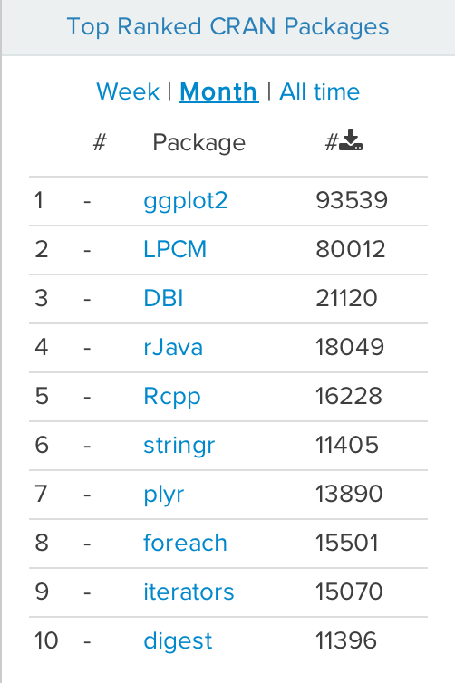
</div>

---

## About this lecture
+ What will be covered:
  + Usual works
  + Common issues encountered in the usual works
+ What will NOT be covered:
  + Dynamic graphing
  + Data preprocessing
  + PIE CHART (I'm sorry.)

---

## Basic Syntax
+ [Official document](http://ggplot2.org/)
+ All you need is `ggplot`
    + There is also `qplot` for a quick and dirty plot (not recommended)
+ Usage: `ggplot(data, aes(), ...) + geoms`
    + data: an object of class `data.frame`; **data** to be plotted
    + aes: a function that returns aesthetic mappings; **variables** to be plotted
    + geoms: geometric objects; the **type** of plot
        + `geom_bar()`, `geom_line()`, `geom_point()`, ...
+ Example:
    + `ggplot(data=iris, aes(x=Sepal.Length, y=Sepal.Width)) + geom_point()`

--- .segue .nobackground .dark

## Bar Plot

---

## Bar Plot: Let's do this in `ggplot2`...

```r
siris <- iris[iris$Sepal.Length > median(iris$Sepal.Length),]
barplot(table(siris$Species))
```

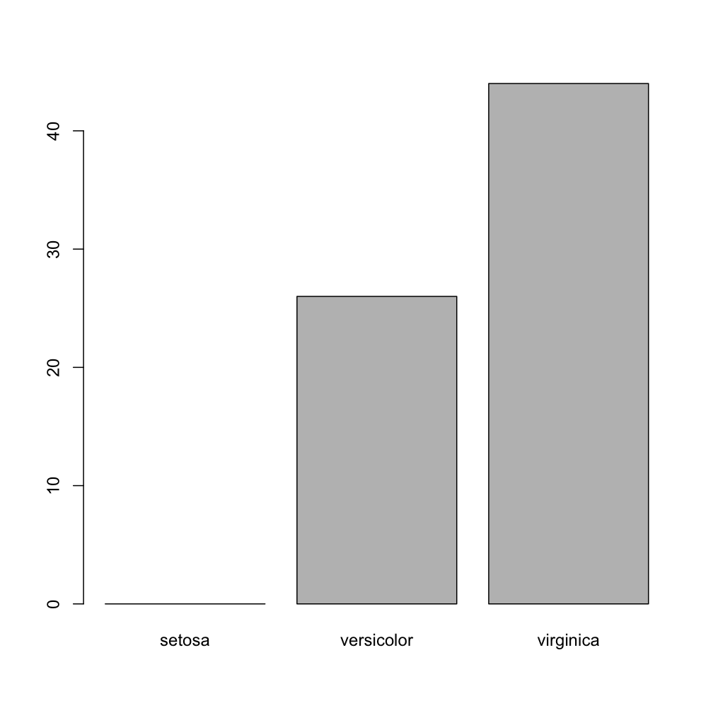

---

## Bar Plot: Oops, Setosa is missing...

```r
ggp <- ggplot(data=siris, aes(x=Species))
ggp + geom_bar()
```

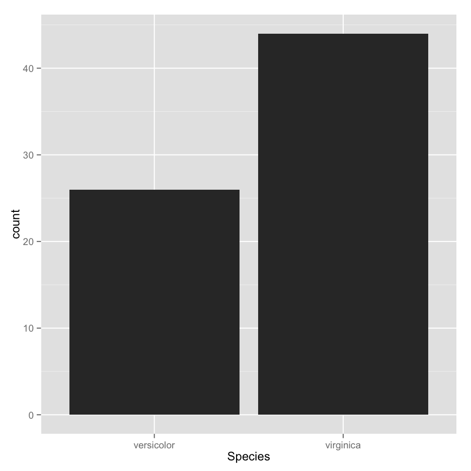

---

## Bar Plot: Force display of x-labels

```r
ggp <- ggp + scale_x_discrete(drop=FALSE) # keep zero-occurence variable
ggp + geom_bar()
```


---

## Bar Plot: Change labels!

```r
ggp <- ggp + ylab('Count') + ggtitle('Hello ggplot!')
ggp + geom_bar()
```

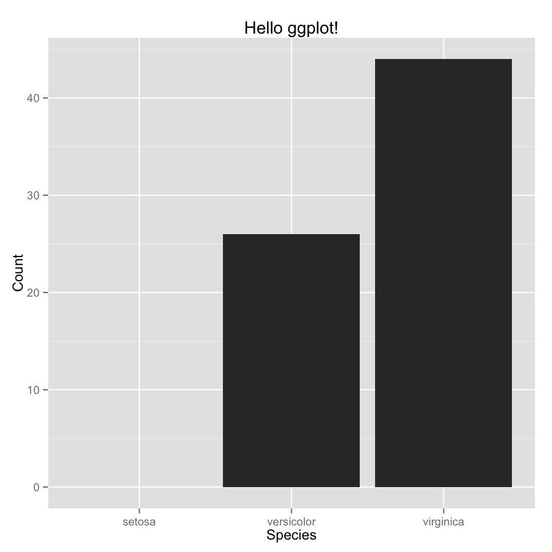

---

## Bar Plot: Change colors!

```r
ggp + geom_bar(fill='snow', color='black') # see colors() if you're picky
```

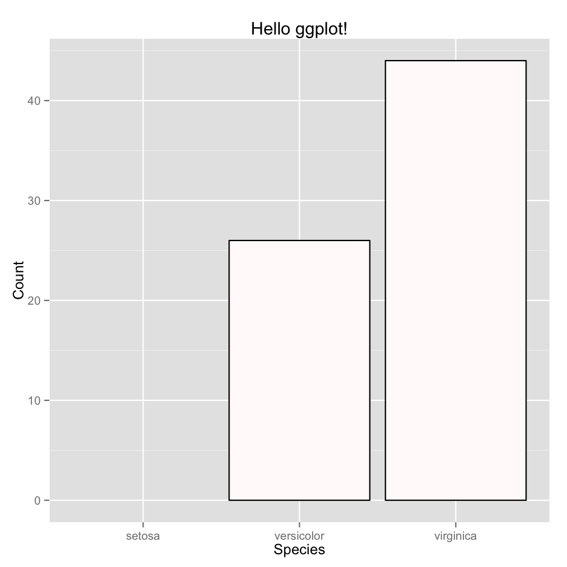

---

## Bar Plot: Stack by group 

```r
siris <- within(siris, Fat <- (Sepal.Width > median(Sepal.Width)))
ggp_bygrp <- ggplot(siris, aes(x=Species, fill=Fat)); ggp_bygrp + geom_bar()
```


---

## Bar Plot: Dodge by group 

```r
ggp_bygrp + geom_bar(position='dodge')
```

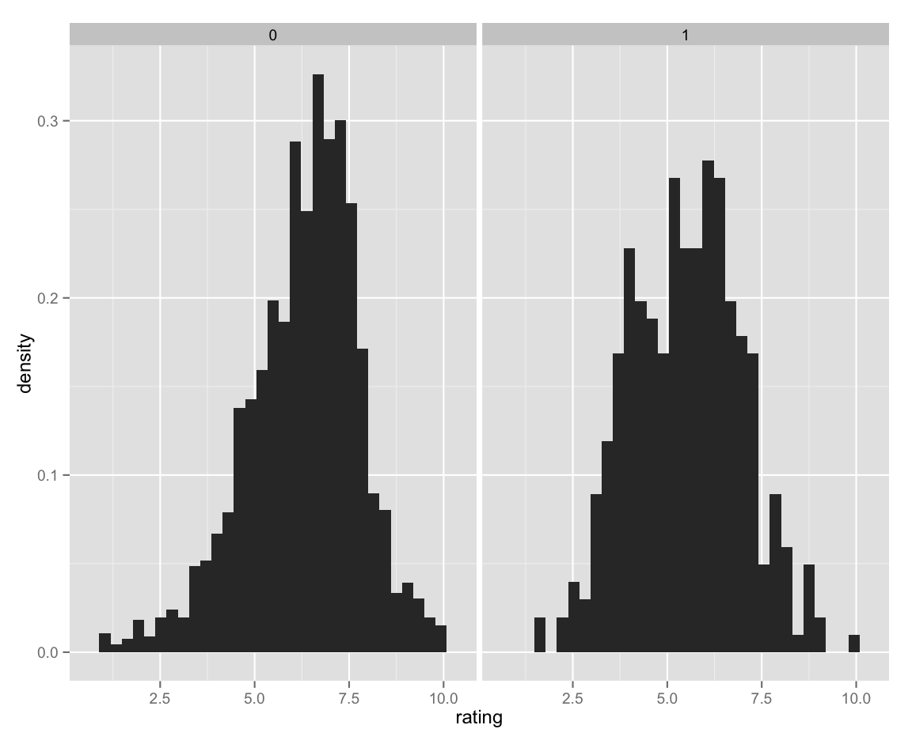

```r
ggp_bygrp + geom_bar(position=position_dodge(1))
```

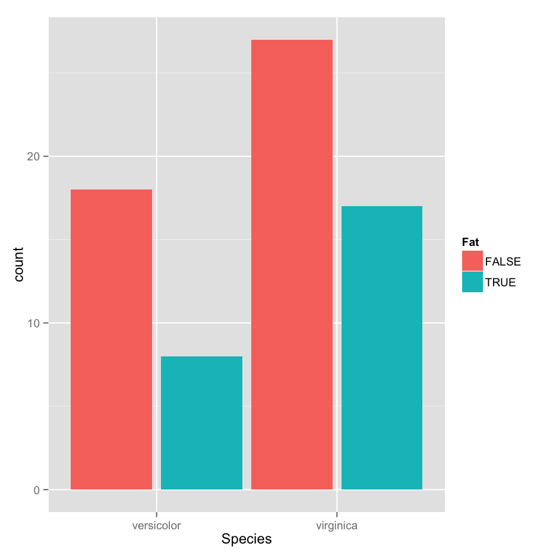

---

## Bar Plot: What if x is continuous...

```r
ggplot(iris, aes(x=Sepal.Length)) + geom_bar() # a HISTOGRAM indeed!
```


---

## Overlapping Histogram

```r
ggplot(iris, aes(x=Sepal.Length, fill=Species)) + 
  geom_bar(position='identity', alpha=.4)
```

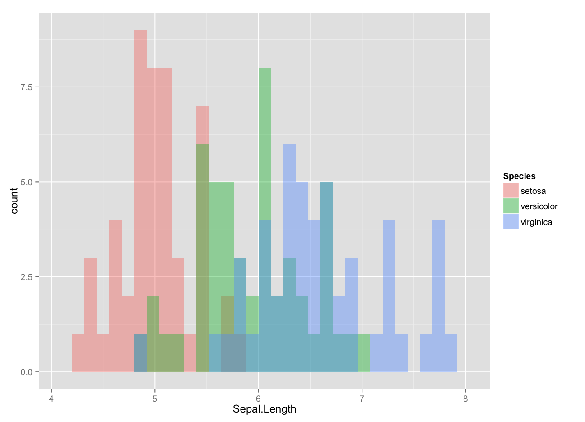

---

## Overlapping Density

```r
ggplot(iris, aes(x=Sepal.Length, fill=Species)) + 
  geom_density(position='identity', alpha=.4)
```

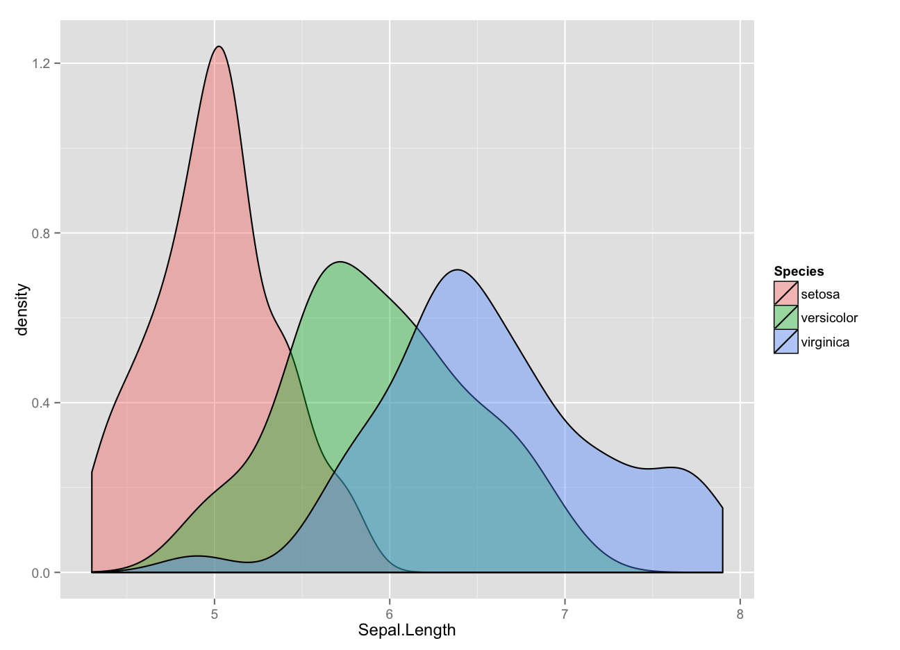


---

## Overlapping Histogram with Density... Oops!

```r
ggplot(iris, aes(x=Sepal.Length, fill=Species)) + 
  geom_bar(position='identity', alpha=.4) + geom_density(position='identity', alpha=.4)
```

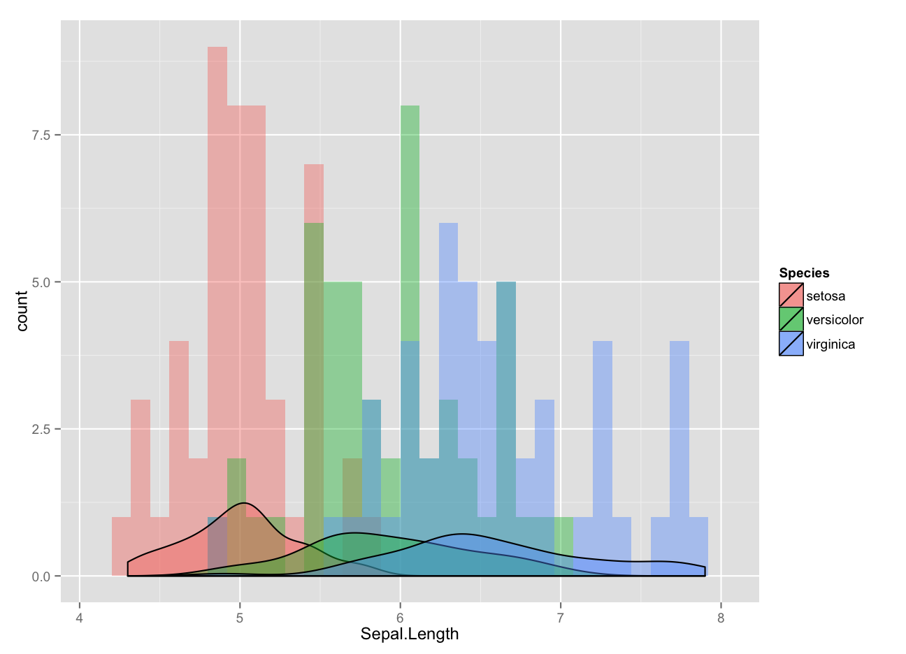

---

## Overlapping Histogram with Density

```r
ggplot(iris, aes(x=Sepal.Length, y=..density.., fill=Species)) + 
  geom_bar(position='identity', alpha=.4) + geom_density(position='identity', alpha=.4)
```

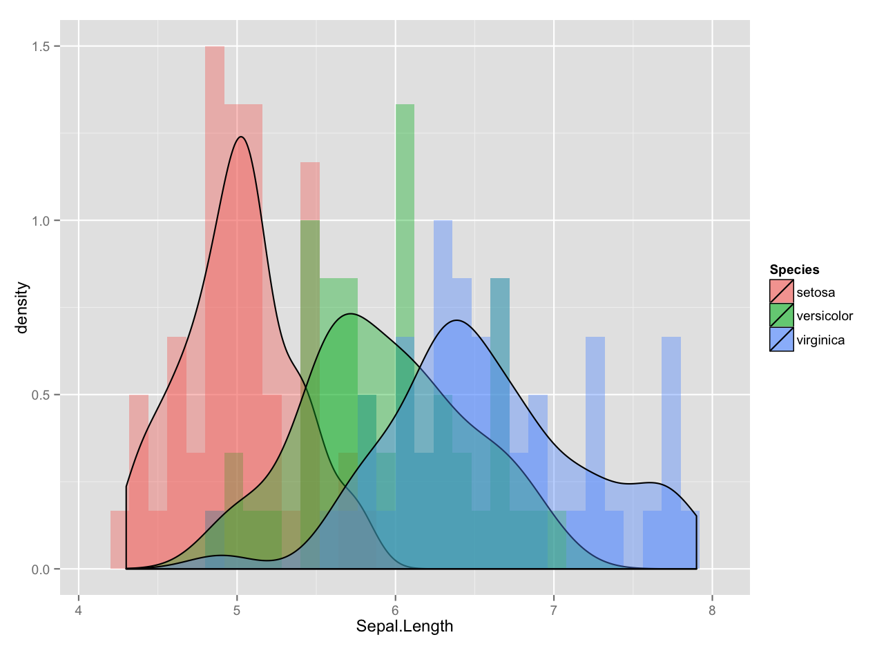

--- &twocol

## Bar Plot: When counts are pre-calculated...


```r
precounted <- as.data.frame(table(siris$Species, dnn=c('Species')))
ggplot(precounted, aes(x=Species, y=Freq)) + geom_bar(stat='identity')
```

*** =left
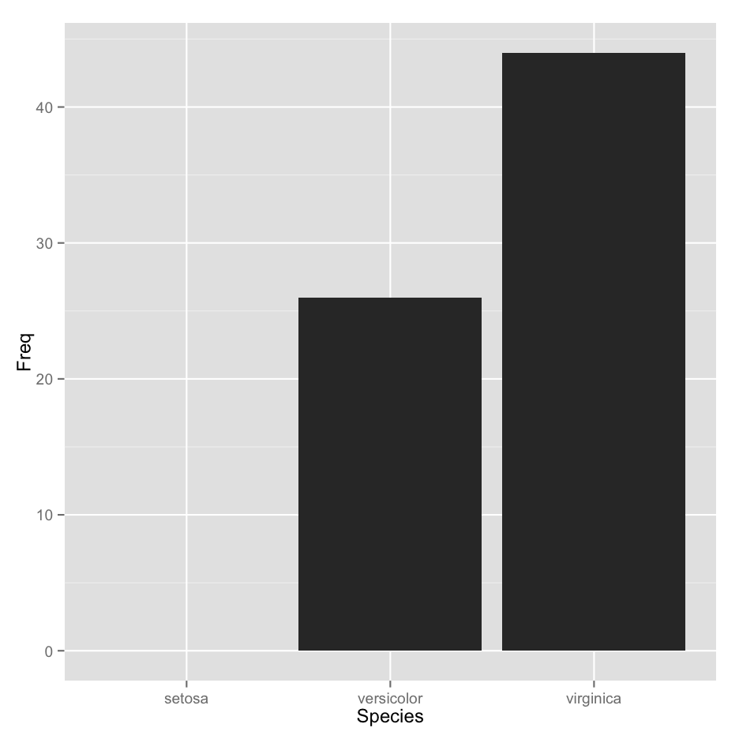

*** =right

```
##      Species Freq
## 1     setosa    0
## 2 versicolor   26
## 3  virginica   44
```
+ Row must be unique
  + Otherwise counts will be summed up
+ 0-occurence label will be present at default
  + Differ from `stat='bin'`
+ Negative bar is allowed

--- &twocol

## Bar Plot: More differences...

```r
precounted$L <- letters[1:3]
ggplot(precounted, aes(x=Species, y=Freq, fill=L)) + geom_bar(stat='identity')
```

*** =left


*** =right

```
##      Species Freq L
## 1     setosa    0 a
## 2 versicolor   26 b
## 3  virginica   44 c
```
+ Argument `fill` behave differently
  + Here it is solely used to fill up colors
  + No "grouping" operation here

---

## Bar Plot: Reorder x

```r
ggplot(precounted, aes(x=reorder(Species, -Freq), y=Freq)) + 
  geom_bar(stat='identity') # The order is determined by factor levels
```


---

## Exercise: Working hours by industry?

```r
load('salary.RData')
par(family='Heiti TC Light') # for OS X (XQuartz device)
hist(salary_2013$平均工時, main=NULL)
```


---

## Exercise: Try to plot this!
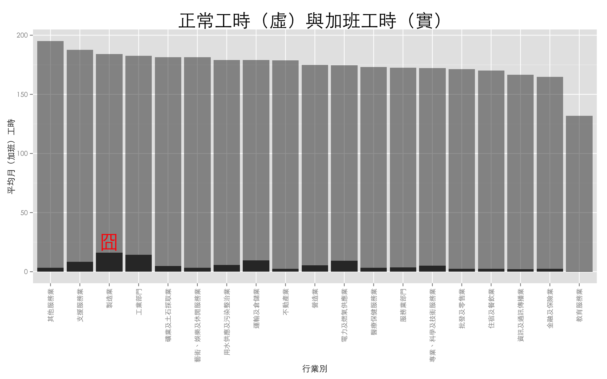

---

## Exercise: Answer

```r
ggplot(salary_2013, aes(x=reorder(行業,-平均工時), y=平均工時)) + # reorder x  
  geom_bar(stat='identity', alpha=.5) + # set transparency  
  labs(x='行業別', y='平均月（加班）工時', title='正常工時（虛）與加班工時（實）') +  
  theme(# for OS X (XQuartz device) to show Chinese characters
        text=element_text(family='Heiti TC Light'), 
        # rotate angle of x ticks
        axis.text.x=element_text(angle=90, hjust=1, vjust=.5),
        # change size of title
        plot.title=element_text(size=26)) +
  
  # argument data is skipped in the second call to geom_bar
  geom_bar(aes(x=行業, y=as.numeric(as.character(加班工時))), stat='identity') +
  
  # add arbitrary text (covered in latter part of this lecture)
  annotate('text', label='囧', color='red', family='Heiti TC Light', size=10, vjust=-.25,
           x=which(levels(reorder(salary_2013$行業,-salary_2013$平均工時)) == '製造業'), 
           y=as.numeric(as.character(salary_2013[salary_2013$行業=='製造業', '加班工時'])))
```

--- &twocol

## Bar Plot: Proportional stacking (1/4)

Quiz time! How to do this?
*** =left
+ Before...
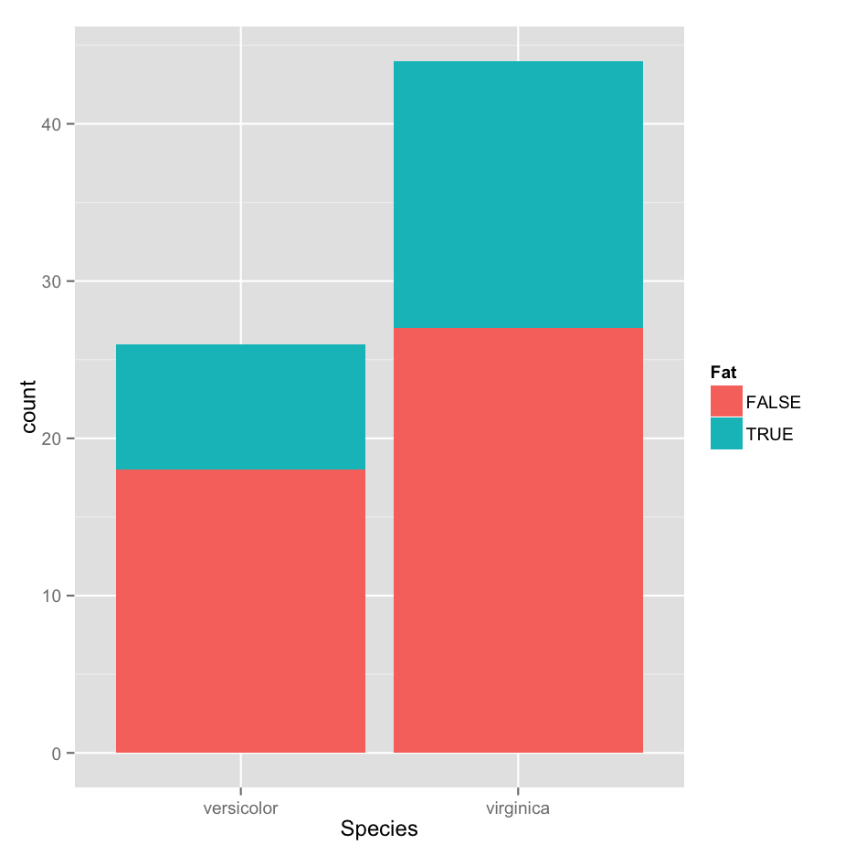
*** =right
+ After...


---

## Bar Plot: Proportional stacking (2/4)
+ Unfortunately, no built-in automation available!
+ Have to make the data proportional, and then use `stat='identity'`

```r
head(siris)[,1:5]
```

```
##    Sepal.Length Sepal.Width Petal.Length Petal.Width    Species
## 51          7.0         3.2          4.7         1.4 versicolor
## 52          6.4         3.2          4.5         1.5 versicolor
## 53          6.9         3.1          4.9         1.5 versicolor
## 55          6.5         2.8          4.6         1.5 versicolor
## 57          6.3         3.3          4.7         1.6 versicolor
## 59          6.6         2.9          4.6         1.3 versicolor
```

---

## Bar Plot: Proportional stacking (3/4)

```r
siris$Count <- 0L
siris_ag <- aggregate(data=siris, Count ~ Species + Fat, FUN=length)
siris_ag <- do.call(rbind, lapply(split(siris_ag, siris_ag$Species), 
                                  function(x) within(x, Pct <- Count/sum(Count))))
rownames(siris_ag) <- NULL
siris_ag
```

```
##      Species   Fat Count    Pct
## 1 versicolor FALSE    18 0.6923
## 2 versicolor  TRUE     8 0.3077
## 3  virginica FALSE    27 0.6136
## 4  virginica  TRUE    17 0.3864
```
+ There are many more elegant (and efficent) ways to do this:
  + `plyr::ddply`
  + `data.table::':='`

---

## Bar Plot: Proportional stacking (4/4)

```r
ggplot(siris_ag, aes(x=Species, y=Pct, fill=Fat)) + geom_bar(stat='identity')
```


---

## Bar Plot: Add some texts...(1/2)

```r
ggplot(siris_ag, aes(x=Species, y=Pct, fill=Fat)) + geom_bar(stat='identity') +
  geom_text(aes(y=Pct, label=Count), color='white') # not easy!
```


---

## Bar Plot: Add some texts...(2/2)

```r
siris_ag <- do.call(rbind, lapply(split(siris_ag, siris_ag$Species), 
                                  function(x) within(x, Cum.Pct <- cumsum(Pct))))
ggplot(siris_ag, aes(x=Species, y=Pct, fill=Fat)) + geom_bar(stat='identity') +
  geom_text(aes(y=Cum.Pct, label=Count), color='white', vjust=1.5)
```

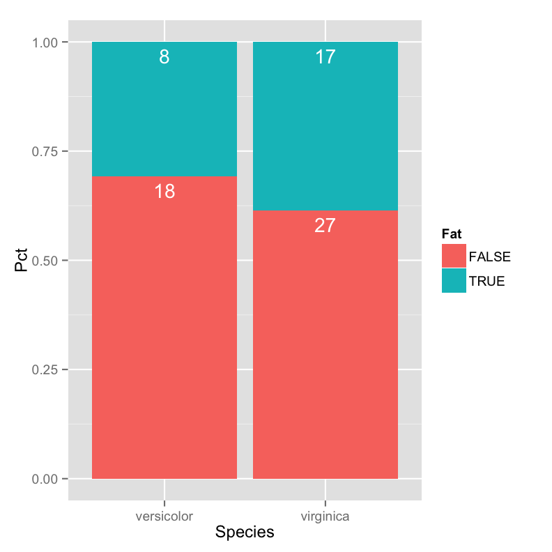

---

<p style='text-align: center; font-size: 40pt;'>Stop. I'm SICK about bar plot.</p>
<br>
<br>
<div style='text-align: center;'>
    
</div>

---

## A Digress: Function Equivalency
+ Mnay of the parameters can be applied in multiple ways
  + 
  + `ggtitle('yor title')` is the same as `labs(title='your title')`
  + See `?labs` for its equivalent calls
+ Many of the functions are siblings of a more general function
  + `geom_vline` is the sibling of `geom_abline`
  + `theme_bw` is a special version of `theme`
    + The default is `theme_grey`

--- .segue .nobackground .dark

## Line Graph

---

## Line Graph

```r
ggplot(iris, aes(x=Sepal.Width, y=Sepal.Length)) + geom_line() # not meaningful
```

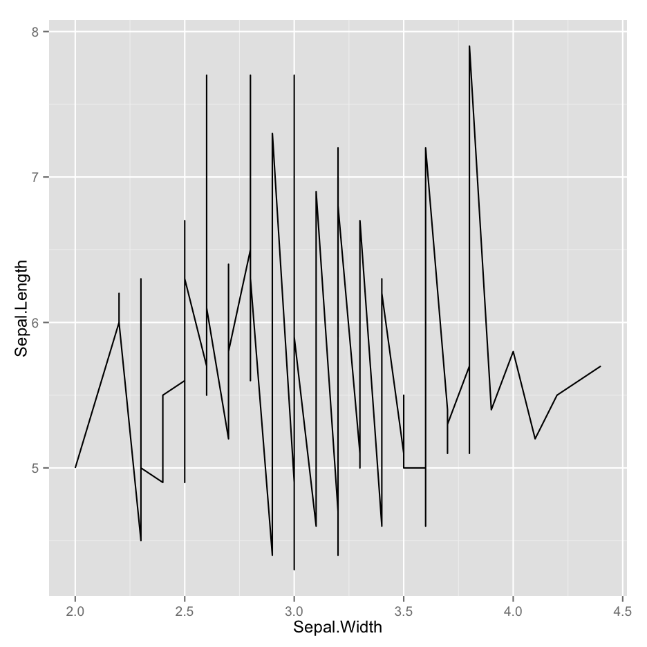

---

<p style='text-align: center; font-size: 40pt;'>AND I am sick about IRIS, too.</p>
<br>
<br>
<div style='text-align: center;'>
    
</div>

---

## Line Graph: Try another sameple data

```r
WorldPhones
str(WorldPhones)
```

```
##      N.Amer Europe Asia S.Amer Oceania Africa Mid.Amer
## 1951  45939  21574 2876   1815    1646     89      555
## 1956  60423  29990 4708   2568    2366   1411      733
## 1957  64721  32510 5230   2695    2526   1546      773
## 1958  68484  35218 6662   2845    2691   1663      836
## 1959  71799  37598 6856   3000    2868   1769      911
## 1960  76036  40341 8220   3145    3054   1905     1008
## 1961  79831  43173 9053   3338    3224   2005     1076
```

```
##  num [1:7, 1:7] 45939 60423 64721 68484 71799 ...
##  - attr(*, "dimnames")=List of 2
##   ..$ : chr [1:7] "1951" "1956" "1957" "1958" ...
##   ..$ : chr [1:7] "N.Amer" "Europe" "Asia" "S.Amer" ...
```

---

## Line Graph: Data.frame only, please!

```r
ggplot(WorldPhones, aes(x=rownames(WorldPhones), y=Asia)) + geom_line()
```

```
## Error: ggplot2 doesn't know how to deal with data of class matrix
```
+ Remember: `ggplot` eat only data.frames

```r
WorldPhones.DF <- as.data.frame(WorldPhones)
WorldPhones.DF$year <- rownames(WorldPhones.DF)
class(WorldPhones.DF) # this time we should be fine!
```

```
## [1] "data.frame"
```

---

## Line Graph: What the...?

```r
ggplot(WorldPhones.DF, aes(x=year, y=Asia)) + geom_line()
```


---

## Line Graph: Correct the discrete-x issue

```r
ggplot(WorldPhones.DF, aes(x=year, y=Asia, group=1)) + geom_line()
```


---

## Line Graph: Or simply make x continous, if possible

```r
ggplot(WorldPhones.DF, aes(x=as.numeric(year), y=Asia)) + geom_line()
```


--- &twocol

## Line Graph: Wait a minute...
Were they really drawn from the same data?
*** =left
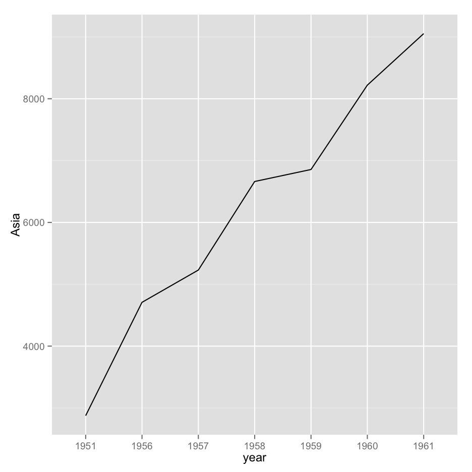

*** =right
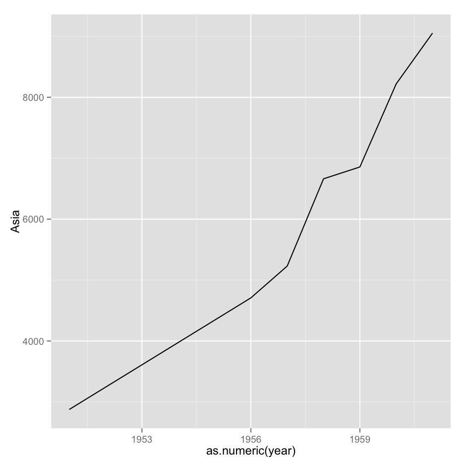

--- &twocol

## Line Graph: Let's mark the data points
Remember? Categorical x at default will not show null data.
*** =left


*** =right
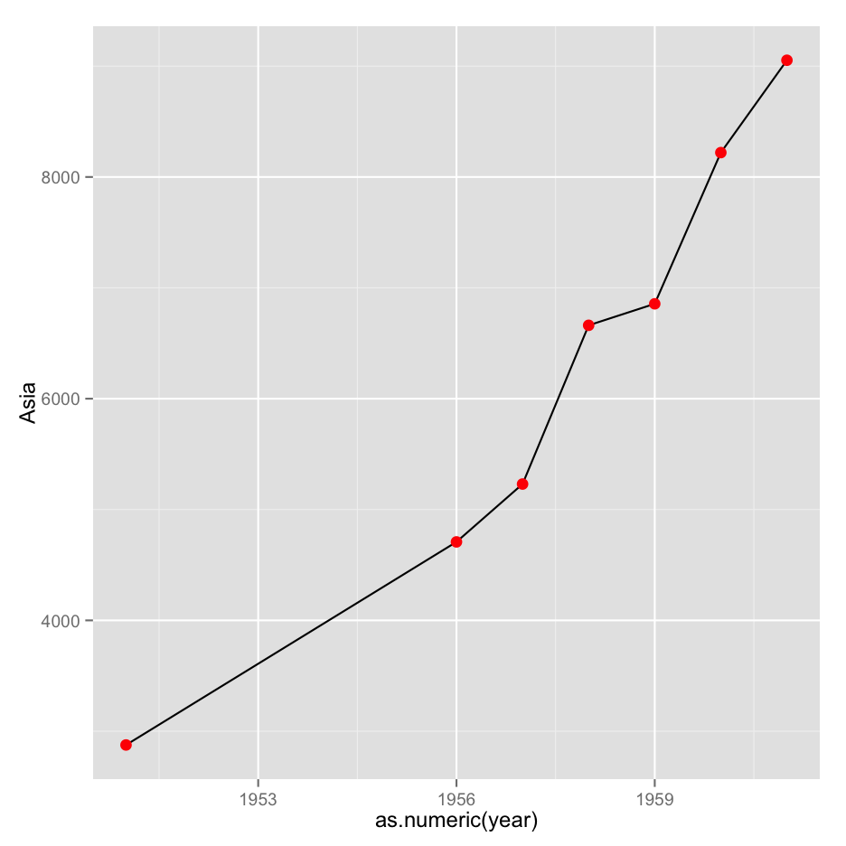

---

## Line Graph: Multi-lining using `matplot`

```r
matplot(x=WorldPhones.DF$year, y=WorldPhones.DF[,1:3], type='l', lty=1, col=1:3)
legend('topleft', legend=colnames(WorldPhones.DF)[1:3], lty=1, col=1:3)
```

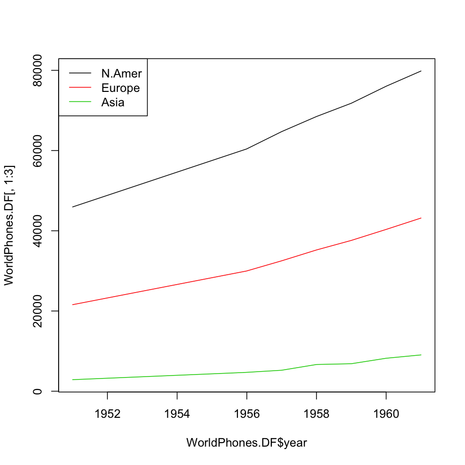

--- &twocol

## Line Graph: Multi-lining
+ Not straightforward in `ggplot`
  + Only accept "long" format, against the "wide" format used in `matplot`

*** =left
Wide format

```
##      N.Amer Europe Asia year
## 1951  45939  21574 2876 1951
## 1956  60423  29990 4708 1956
## 1957  64721  32510 5230 1957
## 1958  68484  35218 6662 1958
## 1959  71799  37598 6856 1959
## 1960  76036  40341 8220 1960
## 1961  79831  43173 9053 1961
```

*** =right
Long format

```
##    Value Region Year
## 1  45939 N.Amer 1951
## 2  60423 N.Amer 1956
## 3  64721 N.Amer 1957
## 4  68484 N.Amer 1958
## 5  71799 N.Amer 1959
## 6  76036 N.Amer 1960
## 7  79831 N.Amer 1961
## 8  21574 Europe 1951
## 9  29990 Europe 1956
## 10 32510 Europe 1957
```

---

## Line Graph: Wide-to-long conversion

```r
# solution 1: use stack
WP <- WorldPhones.DF[, c(1:3, 8)]
WP.long <- cbind(stack(WP[, 1:3]), WP$year)
colnames(WP.long) <- c('Value', 'Region', 'Year')

# solution 2: use reshape
WP.long2 <- reshape(WP, direction='long', varying=list(names(WP)[1:3]), v.names='Value',
                   idvar='year', times=names(WP)[1:3], timevar='Region')

identical(WP.long$Value, WP.long2$Value)
```

```
## [1] TRUE
```
+ Another popular alternative: `reshape2::melt`

--- &twocol

## Line Graph: Wide-to-long conversion

```r
ggplot(WP.long, aes(x=as.numeric(Year), y=Value, color=Region)) + geom_line()
```

*** =left

```r
WP.long[1:12,]
```

```
##    Value Region Year
## 1  45939 N.Amer 1951
## 2  60423 N.Amer 1956
## 3  64721 N.Amer 1957
## 4  68484 N.Amer 1958
## 5  71799 N.Amer 1959
## 6  76036 N.Amer 1960
## 7  79831 N.Amer 1961
## 8  21574 Europe 1951
## 9  29990 Europe 1956
## 10 32510 Europe 1957
## 11 35218 Europe 1958
## 12 37598 Europe 1959
```

*** =right


---

## Line Graph: Or group by linetype

```r
ggplot(WP.long, aes(x=as.numeric(Year), y=Value, linetype=Region)) + geom_line()
```


---

## Line Graph: Again, beware of categorical x...

```r
ggplot(WP.long, aes(x=Year, y=Value, linetype=Region, group=Region)) + geom_line()
```

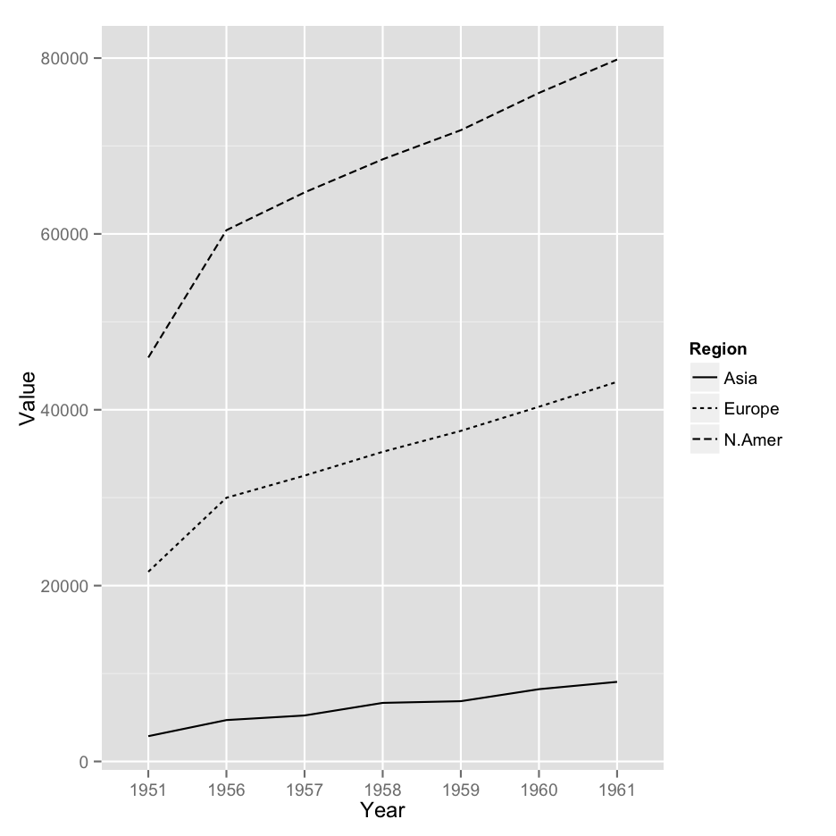

---

## Line Graph: Reverse order of legend labels

```r
ggplot(WP.long, aes(x=as.numeric(Year), y=Value, linetype=Region)) + geom_line() +
  guides(linetype=guide_legend(reverse=TRUE))
```

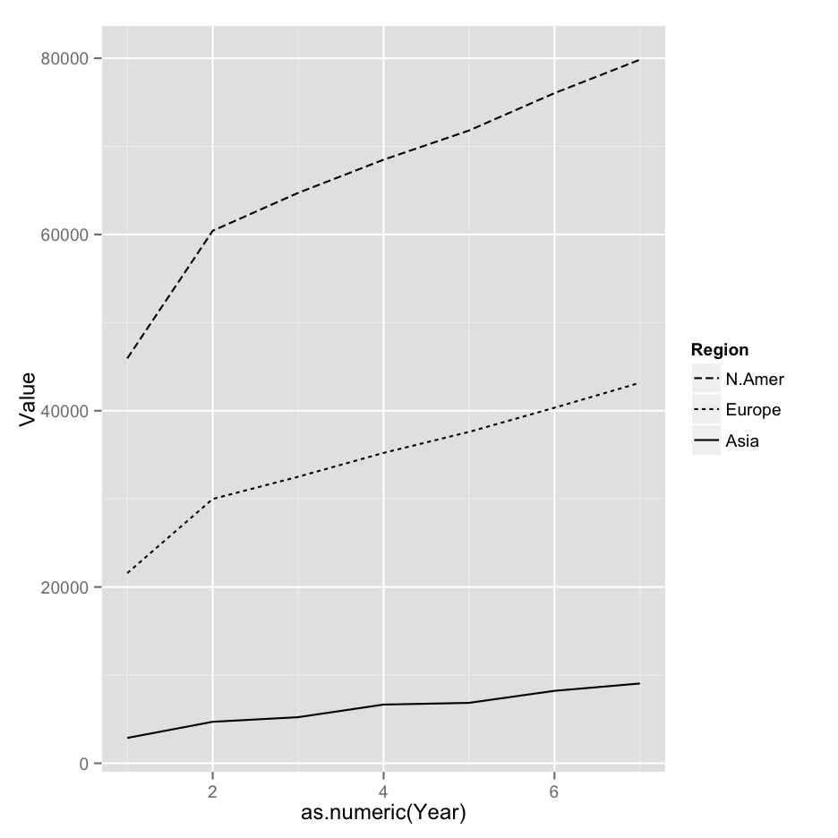

---

## Exercise: Real wage trending down...

```r
load('salary.RData'); par(family='Heiti TC Light') # for OS X (XQuartz device)
plot(x=salary_cpi$year, y=salary_cpi$salary, type='l', xlab='Year', ylab='Wage')
lines(x=salary_cpi$year, y=salary_cpi$real_wage, col='red')
legend('bottomright', c('Nominal', 'Real'), lty=c(1,1), col=c('black','red'), inset=.02)
```

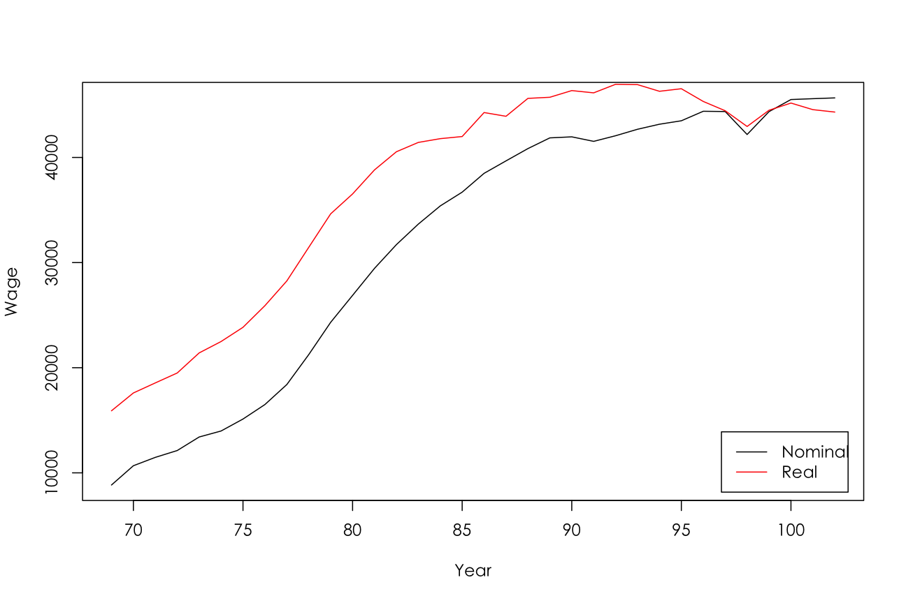

---

## Exercise: Try to plot this!
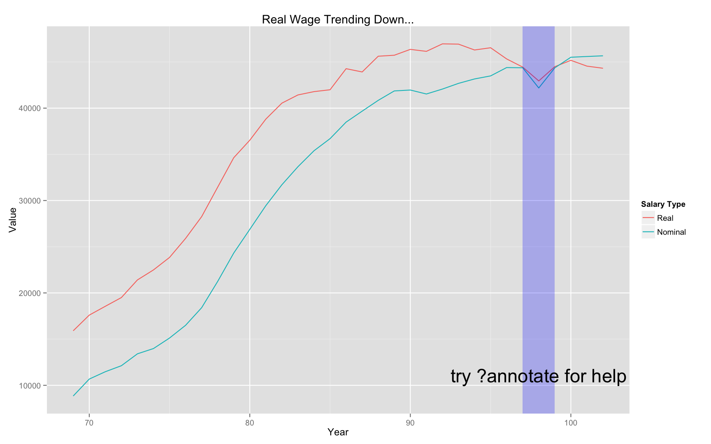

---

## Exercise: Answer

```r
# preprocessing is necessary
tmp <- salary_cpi[, c(1,2,4)]
tmp <- cbind(stack(tmp[, 2:3]), tmp$year)
colnames(tmp) <- c('Value', 'Type', 'Year')

# plot the long-formatted data
ggplot(tmp, aes(x=Year, y=Value, color=Type)) + # use color as grouping var
  geom_line() +
  labs(ylab='NT dollars', title='Real Wage Trending Down...') +
  # manually modify legend info:
  # scale_x_discrete where x is the grouping var which, in this case, is color
  scale_color_discrete(name='Salary Type', labels=c('Real', 'Nominal')) +
  
  # this will be covered latter
  annotate('rect', xmin=97, xmax=99, ymin=-Inf, ymax=Inf, fill='blue', alpha=.25)
```

--- .segue .nobackground .dark

## Scatter Plot

---

## Scatter plot: IMDB data

```r
movies1 <- movies[!is.na(movies$budget),]
ggplot(movies1, aes(x=budget, y=rating)) + geom_point()
```

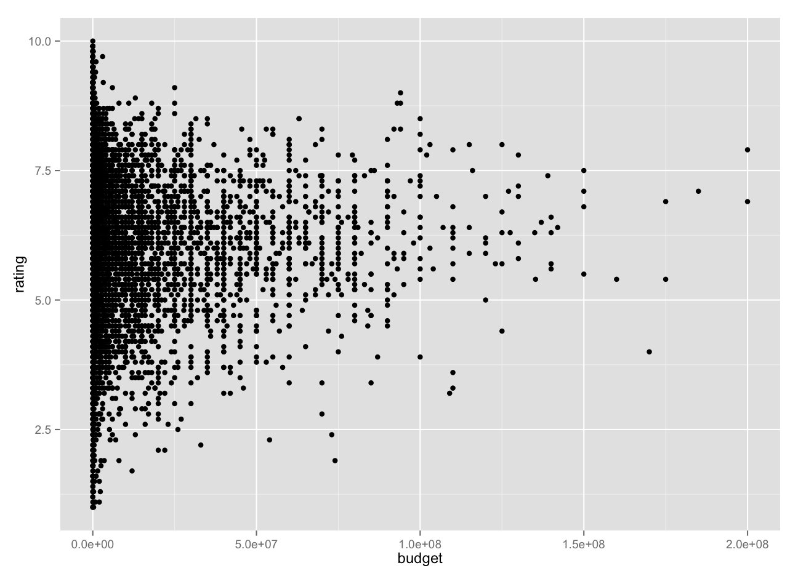

---

## Scatter plot: Control the shape & size of points

```r
ggplot(movies1, aes(x=budget, y=rating)) + geom_point(shape=5, size=3)
```


---

## All point shape types in `ggplot2`


---

## Scatter plot: Grouping with binary variable
This usually happens accidentally.

```r
ggplot(movies1, aes(x=budget, y=rating, color=Action)) + geom_point()
```

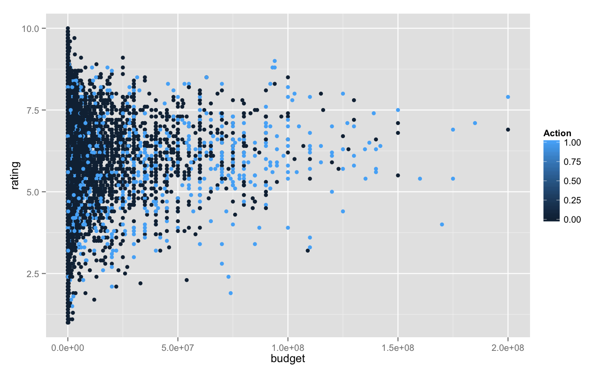

---

## Scatter plot: Grouping with categarical variable

```r
ggplot(movies1, aes(x=budget, y=rating, color=factor(Action))) + 
  geom_point() + labs(color='Action Movie?')
```

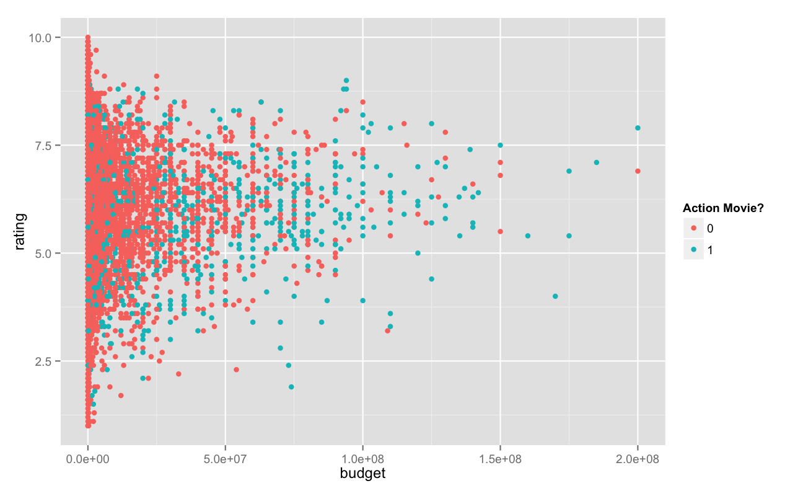

---

## Scatter plot: Multi-grouping

```r
ggplot(movies1, aes(x=budget, y=rating, color=factor(Action), shape=(length > 120))) + 
  geom_point(size=3) + labs(color='Action Movie?')
```

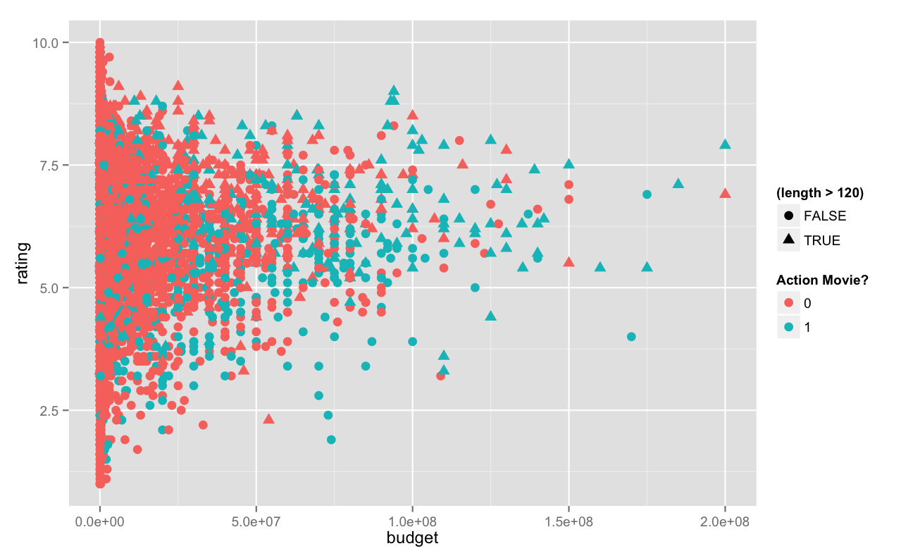

---

## Scatter plot: Fit regression line

```r
ggplot(movies, aes(x=votes, y=rating)) + geom_point() +
  stat_smooth(method=lm, level=.95) # add se=FALSE to disable CI
```

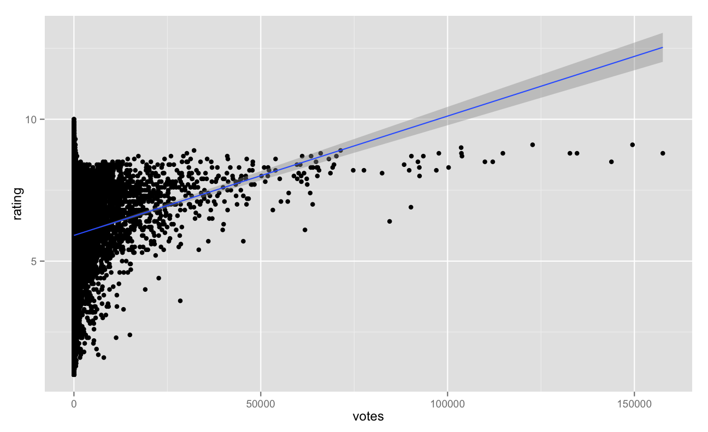

---

## Scatter plot: The default is polynomial fit

```r
ggplot(movies, aes(x=votes, y=rating)) + geom_point() + stat_smooth()
```

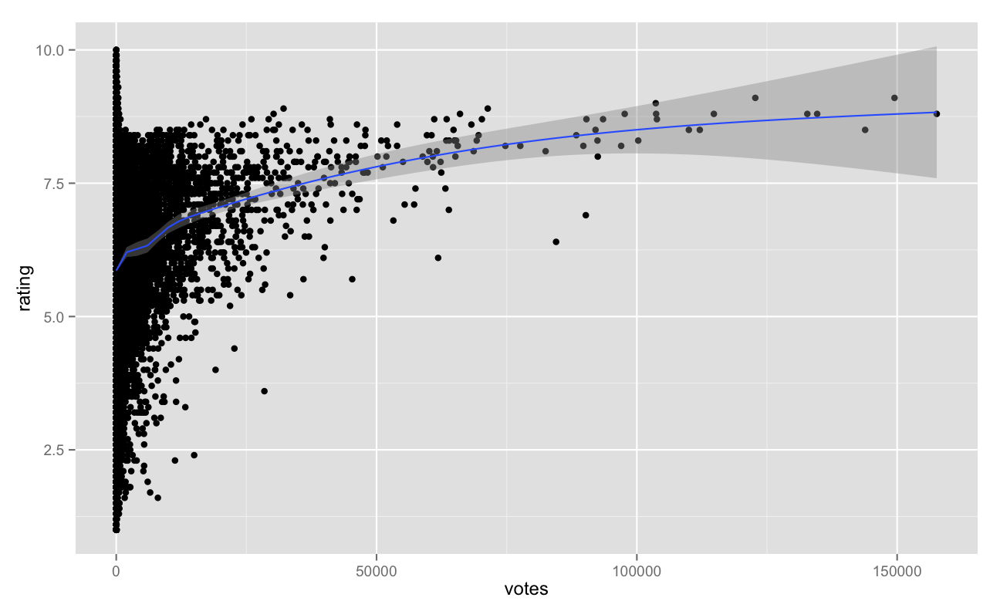

---

## Scatter plot: Fitting is smart to align with grouping

```r
ggplot(movies1, aes(x=budget, y=rating, color=factor(Action))) + 
  geom_point() + labs(color='Action Movie?') + stat_smooth(method=lm, se=FALSE)
```

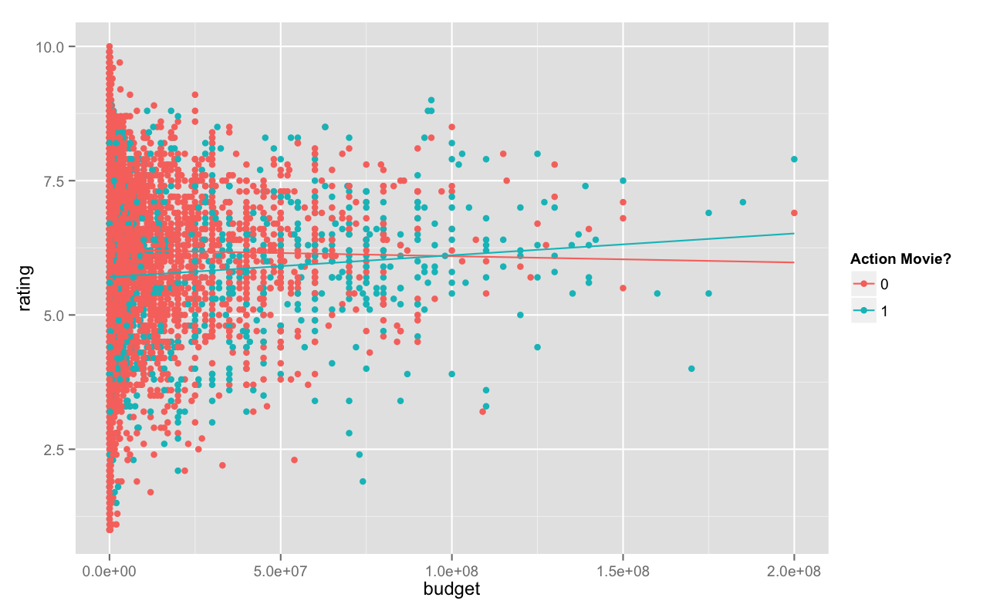

---

## Scatter plot: What if the model is pre-computed?

```r
lm_model <- lm(rating ~ budget, data=movies1)
ggplot(movies1, aes(x=budget, y=rating)) + geom_point() +
  geom_line(aes(x=budget, y=lm_model$fitted.values), color='blue')
```

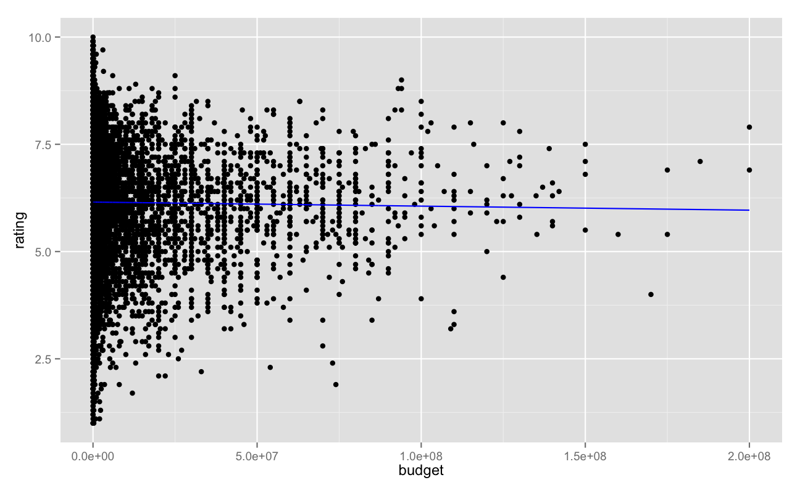

---

## Scatter plot: Anotation

```r
starmovies <- movies[movies$votes > mean(movies$votes),]
starmovies <- starmovies[order(-starmovies$rating),][1:10,]
ggplot(starmovies, aes(x=votes, y=rating)) + geom_point() + geom_text(aes(label=title))
```

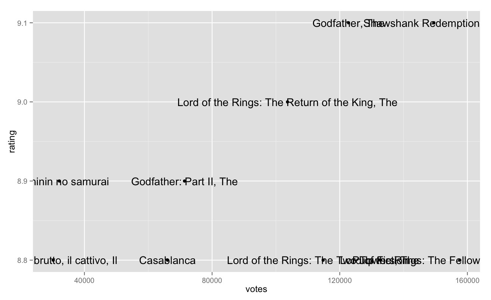

---

## Scatter plot: Fine-tune

```r
ggplot(starmovies, aes(x=votes, y=rating)) + geom_point(color='red') + 
  geom_text(aes(label=title), hjust=0, vjust=0, angle=20) +
  xlim(0, max(starmovies$votes)*2) +
  ylim(min(starmovies$rating), 9.2)
```


--- .segue .nobackground .dark

## Annotation

---

## Annotation

```r
plot(movies1$budget, movies1$rating) # base solution
abline(h=median(movies1$rating), col='red')
text(x=max(movies1$budget)*.9, y=median(movies1$rating), 
     labels='Median of Rating', col='red', pos=1)
```

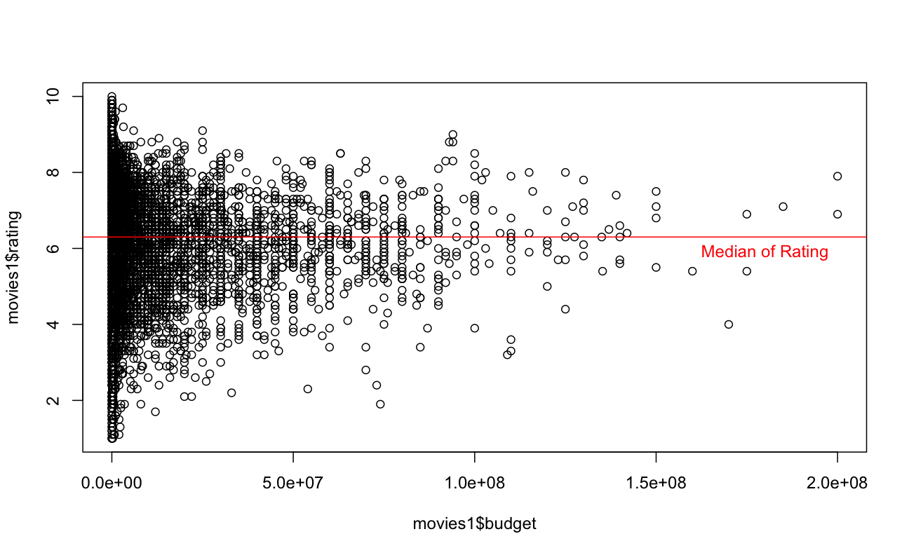

---

## Annotation: Add lines

```r
brggp <- ggplot(movies1, aes(x=budget, y=rating)) + geom_point() 
brggp + geom_hline(yintercept=median(movies1$rating)) # ?geom_abline for general setup
# brggp + geom_hline(data=movies1, aes(yintercept=median(rating)))  # the same
# brggp + geom_hline(aes(yintercept=median(movies1$rating)))        # the same
```

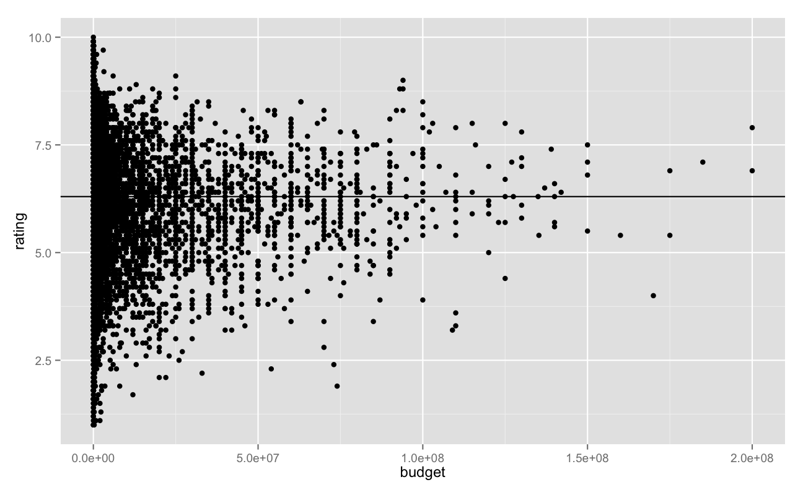

---

## Annotation: Add (single) texts

```r
brggp + geom_hline(yintercept=median(movies1$rating), color='red') + 
  annotate('text', x=Inf, y=median(movies1$rating), 
           label='Medaion of Rating', color='red', vjust=1.2, hjust=1)
# Don't use geom_text for single annotation to avoid overplotting
```

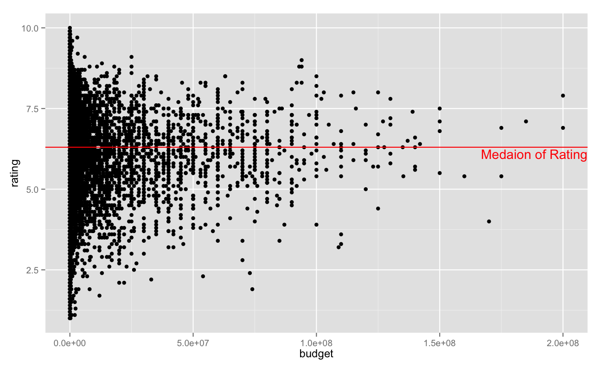

---

## Annotation: Add segments

```r
shaw <- movies1[grep('Shawshank Redemption', movies1$title, fixed=TRUE),]
brggp + annotate('segment', xend=shaw$budget, yend=shaw$rating, x=Inf, y=-Inf,
                 arrow=arrow(), color='red') +
  annotate('text', label='The Shawshank Redemption?', x=Inf, y=-Inf,
           hjust=1.5, vjust=-1, color='red')
```

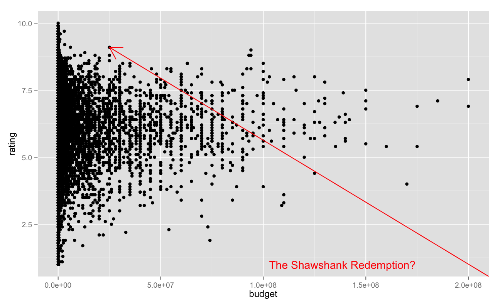

---

## Annotation: Add shaded area

```r
yearcount <- aggregate(title ~ year, data=movies, FUN=length)
ggplot(yearcount, aes(x=year, y=title)) + geom_line() +
  annotate('rect', xmin=1990, xmax=2000, ymin=-Inf, ymax=Inf, fill='blue', alpha=.25)
```

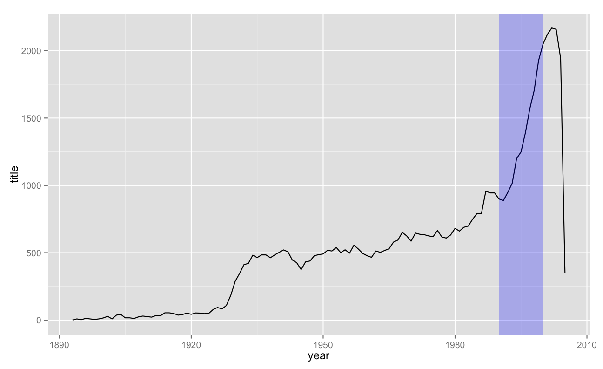

---

## A Digress: Adjust the x ticks with arbitrary breaks

```r
ggplot(yearcount, aes(x=year, y=title)) + geom_line() +
  scale_x_continuous(breaks=seq(min(yearcount$year), max(yearcount$year), 2))
```

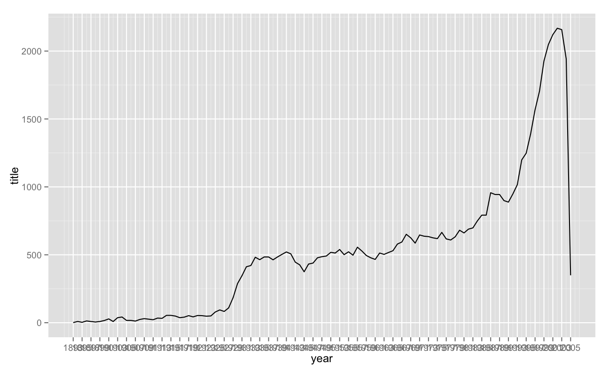

---

## A Digress: Rotate the x-tick labels

```r
ggplot(yearcount, aes(x=year, y=title)) + geom_line() +
  scale_x_continuous(breaks=seq(min(yearcount$year), max(yearcount$year), 2)) + 
  theme(axis.text.x=element_text(angle=90, hjust=1, vjust=.5))
```

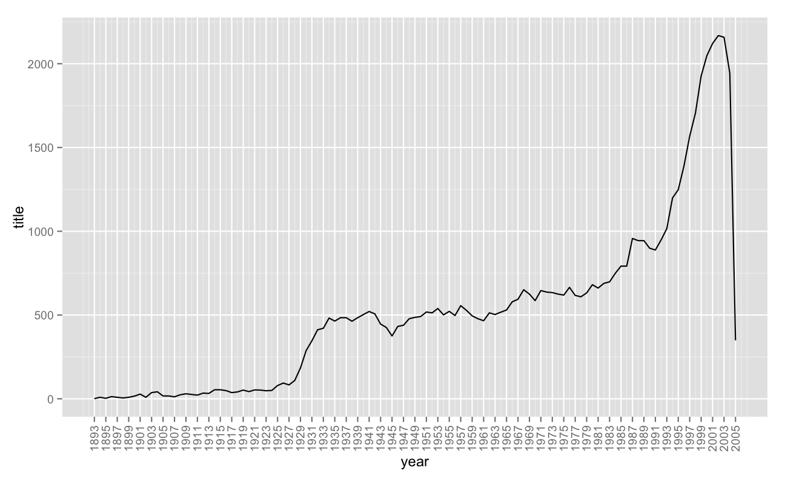

---

## Dealing with timetamp
To be compensated

--- .segue .nobackground .dark

## Facet: Multi-plotting

---

## Facet

---

## Multi-plotting by `gridExtra` (1/2)


```r
library(gridExtra)
drawPoint <- function(i) {
  ggplot(data.frame(x=1, y=1), aes(x=x,y=y)) + 
    geom_point(shape=i, size=5) +
    ggtitle(sprintf('shape=%s',i)) + 
    theme(axis.text.x=element_blank(), axis.text.y=element_blank()) +
    xlab('') + ylab('')
  }
drawPoint(25)
```

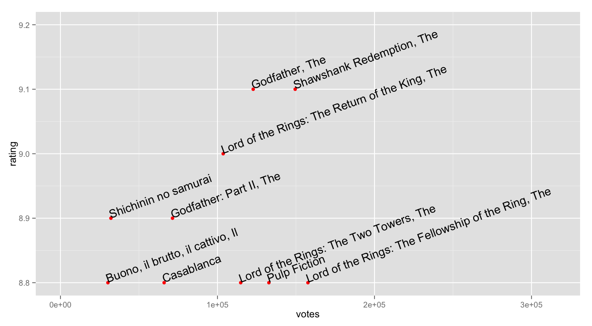

---

## Multi-plotting by `gridExtra` (2/2)


```r
symbol_points <- mapply(drawPoint, 1:25, SIMPLIFY=FALSE)
symbols <- do.call(arrangeGrob, symbol_points)
symbols
```

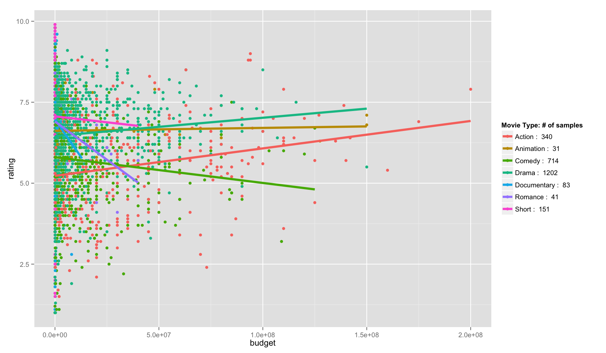

--- .segue .nobackground .dark

## Output

---

## References

+ [R Graphics Cookbook](http://shop.oreilly.com/product/0636920023135.do)


---

#ggplot(movies1, aes(x=length)) + geom_bar()
#ggplot(movies1, aes(x=1L, y=length)) + geom_boxplot()
#ggplot(movies1, aes(x=factor(Action), y=length)) + geom_boxplot()
